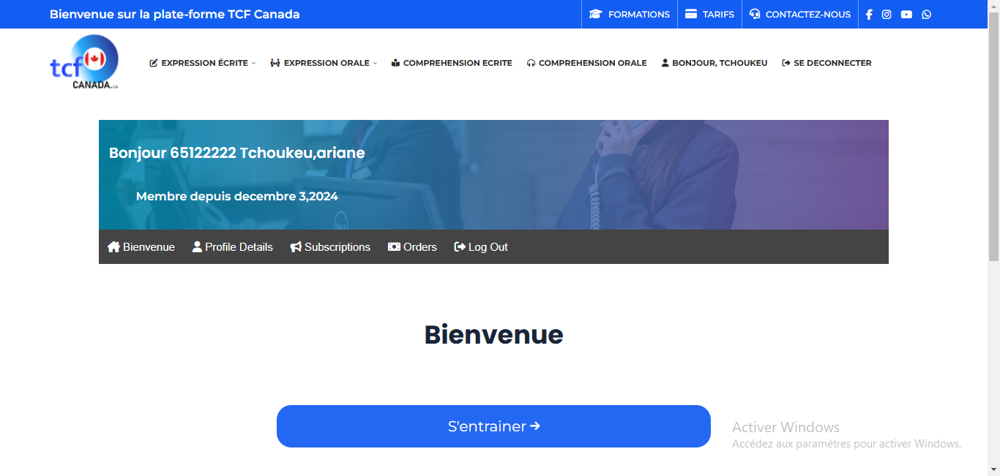

# web development assignment. Login part( this is a copy of a site to have courses to prepare for a Canadian language exam)

## Table of contents

- [Overview](#overview)
  - [The challenge](#the-challenge)
  - [Screenshot](#screenshot)
  - [Links](#links)
- [My process](#my-process)
  - [Built with](#built-with)
- [Author](#author)


## Overview

### The challenge

Users should be able to:

- View the optimal layout depending on their device's screen size
- See hover states for interactive elements

### Screenshot




### Links

- Live Site URL: [tcf canada](https://tp-web-tailwind.vercel.app/)

## My process

### Built with

- Semantic HTML5 markup
- CSS custom properties
- Flexbox
- tailwind css


### What I learned


```html
<div class="deroulement">
    <a href="#" class="visible-a visible-toggle">
        <i class="fa-solid fa-pen-to-square"></i>
        <span>expression écrite</span>
        <i class="fa-solid fa-chevron-down"></i>
    </a>
    <div class="affiche toggle ecrite">
        <a href="#">
            <i class="fa-solid fa-newspaper"></i>
            <span>les sujets d'actualités</span>
        </a>
        <a href="#">
            <i class="fa-solid fa-book-open"></i>
            <span>Methodologie</span>
        </a>
        <a href="#">
            <i class="fa-solid fa-check"></i>
            <span>Correction des sujets 
                  d'expression ecrite</span>
        </a>
        <a href="#">
            <i class="fa-solid fa-pen-to-square"></i>
            <span>Plateforme de redaction</span>
        </a>
    </div>
</div>
```
```css
.deroulement::after {
    content: "";
    position: absolute;
    width: 100%;
    height: 50px; /* Étendre verticalement sans modifier le design */
}
.deroulement:hover .toggle{
    display: block;
}
```

## Author

- Frontend Mentor - [GraceAriane](https://www.frontendmentor.io/profile/GraceAriane)
- linkedIn - [Grace Ariane Tchoukeu](https://www.linkedin.com/in/grace-ariane-tchoukeu)